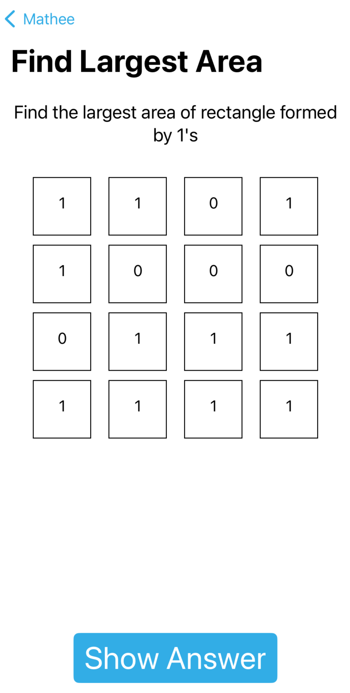
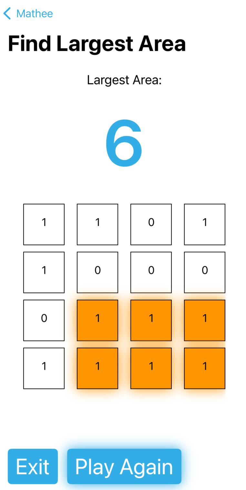
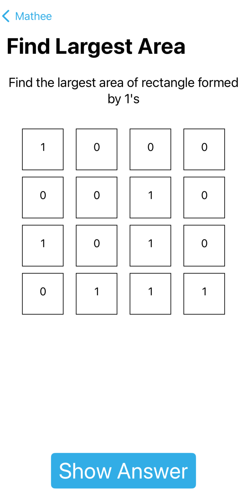
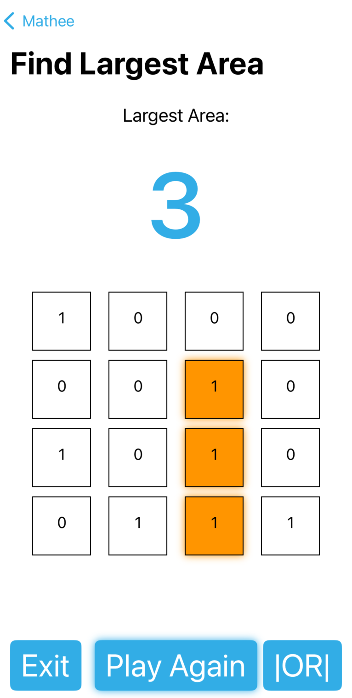
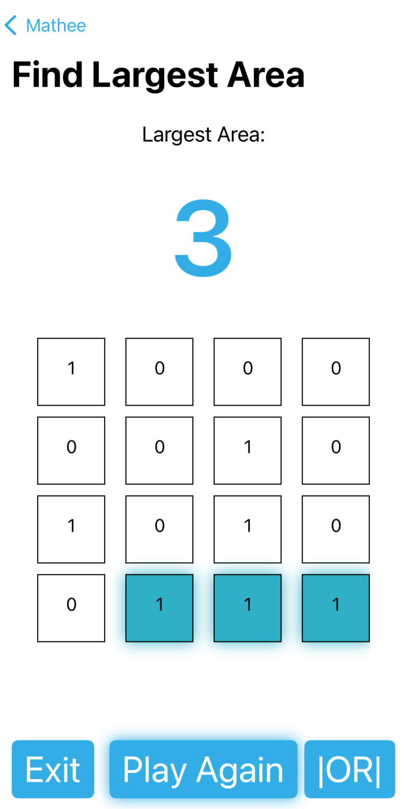

# Mathee
- Love math? Then you will love this math games collection
***
- View on the App Store: click [here](https://apps.apple.com/us/developer/daniel-springer/id1402417666)
***

## Games

### Find Largest Area of Rectangle formed by 1's

#### Motivation and Effectiveness

This game is educational and fun that not only is enjoyable but comes with intelligence building capabilties like:
1. Enhancing Observational Skills
2. Improving Attentiveness
3. Pattern Recognition
4. Counting
5. Basic Math
    * Detecting a Rectangle
    * Area of Rectangle
    * Rectangle vs Squares

#### How to play

In this game, the user is presented with a 4x4 grid of 1's and 0's that are randomly placed. The user needs to calculate the largest area of a rectangle formed by 1's that are adjacent to each other

For example, here is one of the grids

When you hit the "Show Answer" button, the answer is displayed with a glow animation and flashy colors to enlighten children

At this point, you could play again or exit to the main screen of the app.

There could be multiple answers to the quesiton. For example, look at another grid below

The answer is 3. Here is the first answer

The |OR| button allows you to toggle between multiple answers. Here is the second answer

#### Further Improvements and Flexibility

The code is designed to be extendible to support the following:
1. Numbers other than 1's and 0's
2. A bigger or smaller grid size

A button could also be added that takes a screen snapshot and posts the winning streak of a user on social media

